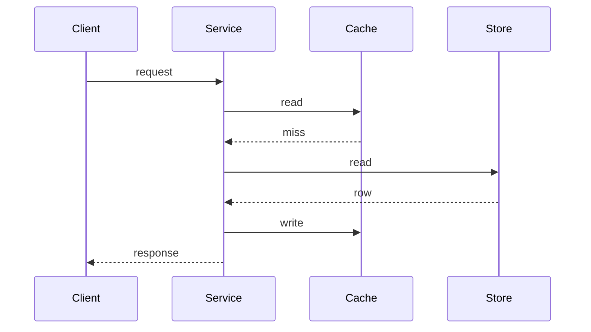

This file exists only to prove the diagram pipeline renders, inlines and
prerenders correctly. It is not content. It makes no claim about anything, states
no number, and is deleted before this branch is merged.

## Architecture diagram

```mermaid Example architecture, placeholder boxes only, no claim about any real system
flowchart LR
  A[Client] --> B[Edge]
  B --> C[Service]
  C --> D[(Store)]
  C --> E[(Cache)]
```

## Sequence diagram



## A code fence, which must still highlight normally

```typescript
export function placeholder(value: string): string {
  return value.trim();
}
```
